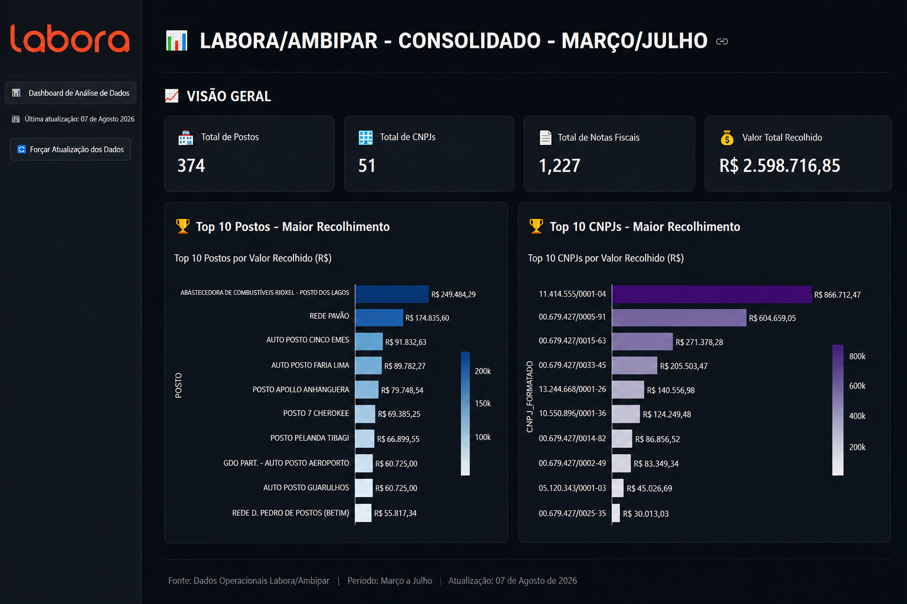

##   

# 📊 Operação Labora/Ambipar | Operations Analytics Dashboard

> Dashboard de Data Analytics desenvolvido com Python e Streamlit para transformar dados operacionais em KPIs, visualizações e informações gerenciais para apoio à tomada de decisão.


---

## 🌐 Aplicação Online

### 🚀 [Acessar o Dashboard](https://operacao-labora-ambipar-7ue494brbdawvj7pd3qqic.streamlit.app/)

---

## 💼 Sobre o Projeto

O **Operação Labora/Ambipar** é um projeto de **Data Analytics aplicado à gestão operacional**, desenvolvido para transformar uma base estruturada de dados em uma visão gerencial simples, interativa e orientada a indicadores.

A solução utiliza **Python e Pandas** para tratamento, organização e agregação dos dados, **Plotly** para visualizações e **Streamlit** para disponibilização das análises em uma interface web interativa.

O dashboard permite acompanhar os principais resultados da operação, analisar a distribuição de volume e valor entre postos e CNPJs e identificar concentrações e diferenças de desempenho que podem apoiar o processo de tomada de decisão.

---

## 🎯 Problema de Negócio

Bases operacionais podem conter grande volume de registros sem necessariamente oferecer uma visão clara sobre o desempenho da operação.

O projeto parte da seguinte questão:

> **Como transformar registros operacionais em informações gerenciais que facilitem o acompanhamento de performance e a identificação de padrões relevantes?**

Para responder a essa questão, a aplicação estrutura os dados em **KPIs, rankings e análises detalhadas**, permitindo uma leitura mais rápida dos resultados.

---

## 📊 Principais KPIs

O dashboard consolida indicadores relacionados à operação, incluindo:

- Total de postos
- Total de CNPJs
- Quantidade de notas fiscais processadas
- Valor total recolhido
- Distribuição de volume por posto
- Distribuição de volume por CNPJ
- Distribuição de valor por posto
- Distribuição de valor por CNPJ

---

## 🔎 Análises Disponíveis

### Visão Geral

Apresentação consolidada dos principais indicadores da operação.

### Rankings por Valor

- Top 10 postos por valor recolhido
- Top 10 CNPJs por valor recolhido

### Rankings por Volume

- Top 10 postos por quantidade de notas
- Top 10 CNPJs por quantidade de notas

### Análises Detalhadas

- Análise individual por posto
- Análise individual por CNPJ
- Formatação automática de CNPJs
- Exploração dos dados por meio da interface

### Exportação

A aplicação permite exportar resultados consolidados em formato CSV para análises complementares.

---

## 📸 Dashboard

[](https://operacao-labora-ambipar-7ue494brbdawvj7pd3qqic.streamlit.app/)

> Clique na imagem para acessar a aplicação.

---

## 🔄 Pipeline Analítico

```text
Base Excel
    │
    ▼
Leitura dos dados
    │
    ▼
Tratamento e organização
    │
    ▼
Pandas
    │
    ▼
Agregações e cálculo de KPIs
    │
    ▼
Visualizações com Plotly
    │
    ▼
Dashboard Streamlit
    │
    ▼
Análise gerencial
    │
    ▼
Exportação de resultados
```

---

## 🛠️ Stack Tecnológica

| Tecnologia | Aplicação |
|---|---|
| **Python** | Desenvolvimento e processamento dos dados |
| **Pandas** | Limpeza, transformação, agregação e análise |
| **Streamlit** | Interface web e construção do dashboard |
| **Plotly** | Visualizações interativas |
| **OpenPyXL** | Leitura e integração com arquivos Excel |
| **Excel / CSV** | Fonte de dados e exportação de resultados |

---

## 📁 Estrutura do Projeto

```text
Operacao-Labora-Ambipar/
│
├── assets/
│   └── dashboard-preview.png
│
├── Dashboard.py
├── requirements.txt
├── PLANILHA.xlsx
└── README.md
```

### Arquivos principais

**`Dashboard.py`**  
Aplicação principal responsável pelo processamento dos dados, cálculo dos indicadores, visualizações e interface Streamlit.

**`PLANILHA.xlsx`**  
Base utilizada pela aplicação para processamento dos indicadores.

**`requirements.txt`**  
Dependências necessárias para execução do projeto.

**`assets/`**  
Recursos visuais utilizados na documentação.

---

## 📁 Estrutura dos Dados

A aplicação utiliza uma base Excel contendo informações operacionais utilizadas na geração dos indicadores.

Entre os principais campos analisados estão:

- Posto
- CNPJ Ambipar
- Quantidade de notas
- Valor recolhido

Esses dados são tratados e agregados para produzir diferentes níveis de análise operacional.

---

## 💡 Business Insights

A estrutura analítica desenvolvida permite identificar aspectos relevantes da operação, como:

- concentração de volume entre postos e CNPJs;
- concentração financeira dos valores processados;
- diferenças de desempenho entre unidades;
- identificação dos principais responsáveis pelo resultado consolidado;
- acompanhamento de KPIs em uma visão centralizada.

O projeto demonstra como dados operacionais podem ser transformados em **informação gerencial**, reduzindo a necessidade de interpretação manual de planilhas e facilitando a identificação de padrões relevantes para a gestão.

---

## 🧠 Competências Demonstradas

Este projeto aplica conceitos e práticas de:

- Data Analytics
- Operations Analytics
- Business Intelligence
- Python aplicado a dados
- Data Cleaning & Transformation
- Análise Exploratória de Dados
- KPI Management
- Data Visualization
- Dashboard Development
- Performance Analysis
- Data-Driven Decision Making
- Transformação de dados em insights de negócio

---

## 📚 Contexto de Desenvolvimento

O projeto foi desenvolvido como desafio do curso de **Streamlit**, integrante da trilha **Avançado em Data Science com Python — Alura**.

A proposta acadêmica foi utilizada como oportunidade para aplicar técnicas de análise e visualização de dados a um contexto operacional, aproximando o desenvolvimento técnico de uma aplicação voltada a **gestão, performance e tomada de decisão**.

---

## 👤 Autor

### Marcus Guedes

**Project Management | PMO | Operations & Performance | Data Analytics & AI for Business**

[GitHub](https://github.com/MCLG1661) • [LinkedIn](https://www.linkedin.com/in/marcusguedes/)

---

⭐ Este projeto faz parte do meu portfólio de aplicações de **Data Analytics, Inteligência Artificial e tecnologia aplicada a problemas de negócio**.

